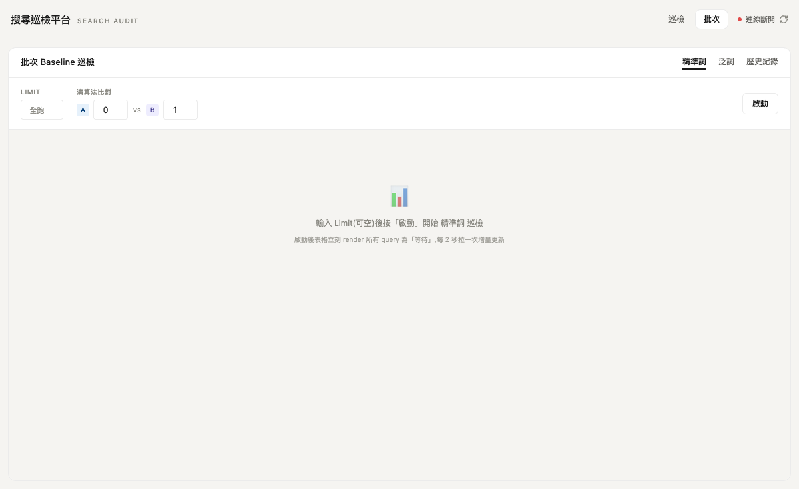
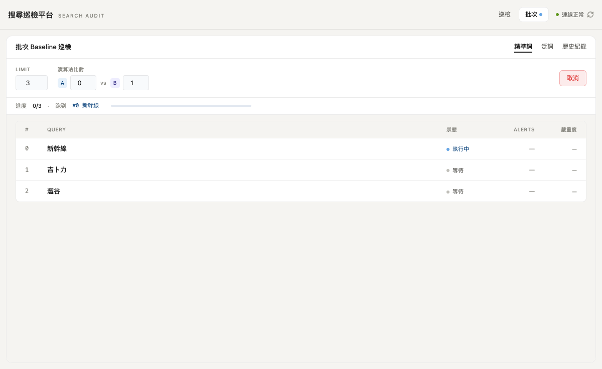
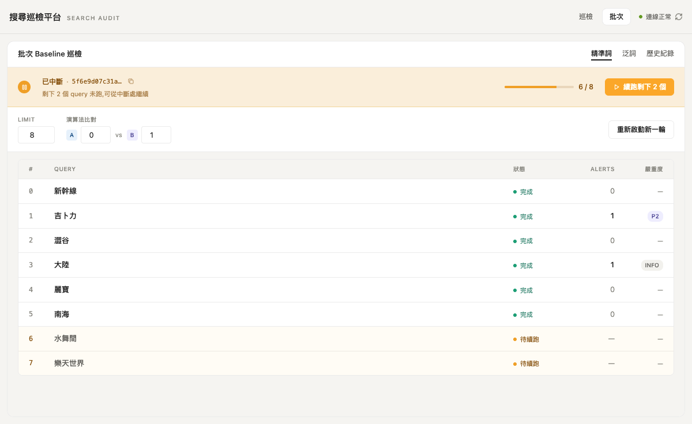
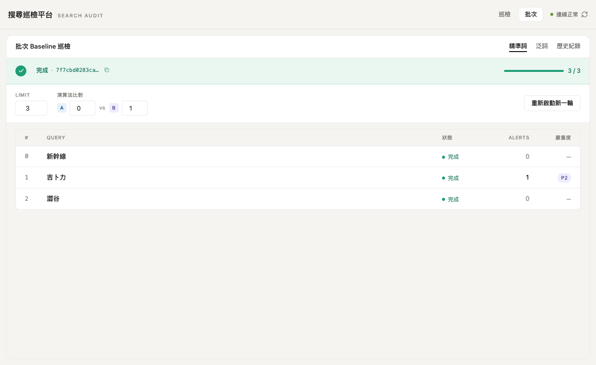
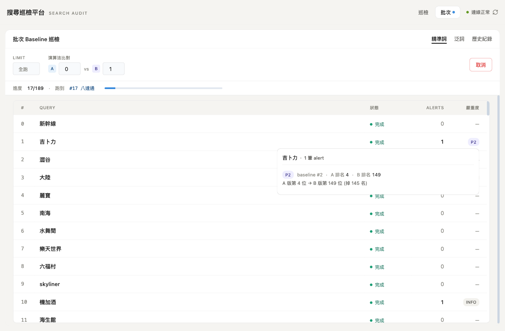

# 搜尋巡檢平台 / Search Audit Platform

KKDay 搜尋結果品質巡檢工具，支援單次/批次關鍵字巡檢、A/B 版本對比、Baseline 守門商品監控。

📖 **完整功能與判斷邏輯說明**：[搜尋巡檢平台 — 功能與判斷邏輯說明 (Confluence)](https://kkday.atlassian.net/wiki/spaces/QS/pages/1969225751)
🌐 **SIT 部署**：<http://autotest-service.sit.kkday.com:8081/explore_platform/>

## 快速開始

```bash
cp .env.example .env   # 填入必要的環境變數 (含 GOOGLE_APPLICATION_CREDENTIALS / BQ_PROJECT_ID)
./start.sh             # 啟動 backend (:19426) + frontend (:5888)
```

詳細架構、API 端點、環境變數說明請參考 [CLAUDE.md](./CLAUDE.md)。

## 主要功能

- **統一巡檢** — 輸入關鍵字，同時取得 A/B 兩版搜尋結果,自動判定每個商品的意圖匹配度 (T1/T2/T3/MISS);搜尋狀態跨頁存活(從 `/batch` 切回 `/` 不會被重置)
- **Baseline 標註** — 自動標記精準詞 Top1/Top2 與泛詞利潤排名前 10 的守門商品
- **A/B 對比** — 比較兩個演算法版本間 baseline 商品的排名變化,產生嚴重度分級告警
- **批次巡檢(async + checkpoint)** — 獨立 `/batch` 三 tab(精準/泛/歷史),sqlite 化每筆 query 進度,支援中途取消、續跑、最近 50 筆歷史。Polling 跨頁存活,切到 `/` 跑單詞時批次 run 仍會持續推進
- **BQ 每日 cron** — 自動每日 07:00 (Asia/Taipei) 從 BigQuery view 抽取最新 baseline,自動版本化、自動 reload;UI banner 在抽取失敗或量級異常時主動提醒
- **手動 Plan B** — 跑 `scripts/fetch_baseline_bq.py` CLI 或從 UI「立即從 BQ 抽取」按鈕,可隨時觸發手動更新
- **CSV 匯出** — 一鍵匯出巡檢結果,BOM+UTF-8 確保 Excel/Numbers 相容
- **人工校正** — PM 可手動覆寫商品 Tier,校正結果持久化並自動套用

## 批次巡檢畫面(PR #27)


*空狀態:設定 limit + A/B 版本 → 啟動*


*Running:無大 status bar(spec §5.3 Q1),只有 inline 進度行 + 表格 row 狀態點(• 等待 / • 執行中 / • 完成)*


*中斷:橘色 status bar + 「續跑剩下 N 個」CTA;未完成 row 帶淡黃底*


*完成:綠色 status bar + summary pills(P0/P1/P2/INFO 計數);點 query 可跳 `/?keyword=...&filter=diff`*


*滑鼠移到嚴重度 chip 跳 alert 細項 popup(baseline rank、A/B rank、reason)*

## 技術架構

- **Frontend**: React + React Router + Vite + Tailwind CSS (無 TypeScript)
- **Backend**: FastAPI + SQLite + APScheduler
- **Search API**: KKDay v3 search API，透過 `test_exp` 參數切換演算法版本
- **Baseline 上游**: BigQuery view `kkday-data-dap-sit.dm_search_keyword.kkday_search_keyword_{precise,broad}` (Joyce v4 規格)

## EC2 / Docker 部署

```bash
# 1. 把 SA JSON 放到 handoff/_secrets/ (此目錄已 .gitignore)
sudo mkdir -p handoff/_secrets && sudo chmod 700 handoff/_secrets
# scp 你的 SA JSON 到 handoff/_secrets/, 然後:
sudo chmod 600 handoff/_secrets/<your-sa>.json

# 2. 填 .env
# GOOGLE_APPLICATION_CREDENTIALS=/home/ubuntu/ai_studio/explore_platform/handoff/_secrets/<your-sa>.json
# BQ_PROJECT_ID=kkday-data-dap-sit

# 3. 起 container
sudo docker compose up -d --build
sudo docker logs -f sip_backend --tail 30
```

預期看到 `[BaselineCron] registered daily fetch at 07:00 Asia/Taipei`。

## 相關文件

- [CLAUDE.md](./CLAUDE.md) — 開發者文件 (架構、API、env vars、設計決策)
- [Confluence: 功能與判斷邏輯說明](https://kkday.atlassian.net/wiki/spaces/QS/pages/1969225751) — PM/QA 視角的功能規格
